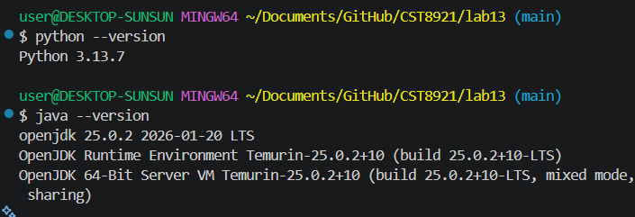
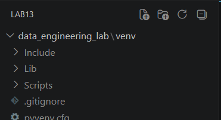
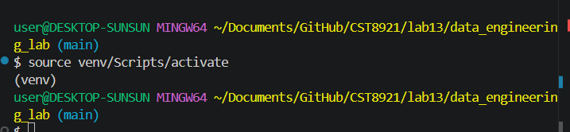
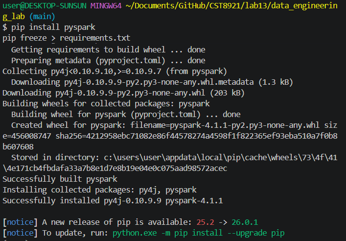
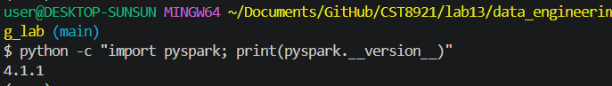
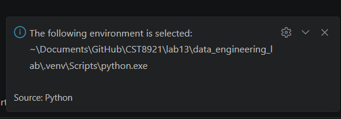
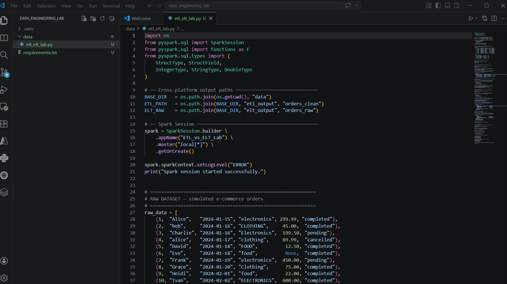
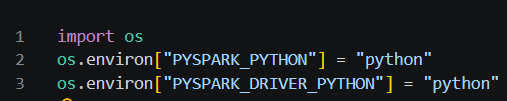
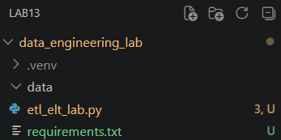

# Lab 13 - PySpark

## Install the Prerequisites



## Create Project Files & Set Up Interpreter










## Run the Script

```bash
python etl_elt_lab.py
$ python etl_elt_lab.py
Setting default log level to "WARN".
To adjust logging level use sc.setLogLevel(newLevel). For SparkR, use setLogLevel(newLevel).
Spark session started successfully.
=======================================================
RAW DATA (as extracted from source)
=======================================================
+--------+--------+----------+-----------+------+---------+                     
|order_id|customer|order_date|   category|amount|   status|
+--------+--------+----------+-----------+------+---------+
|       1|   Alice|2024-01-15|electronics|299.99|completed|
|       2|     bob|2024-01-16|   CLOTHING|  45.0|completed|
|       3| Charlie|2024-01-16|Electronics| 199.5|  pending|
|       4|   alice|2024-01-17|   clothing| 89.99|cancelled|
|       5|   David|2024-01-18|       FOOD|  12.5|completed|
|       6|     Eve|2024-01-18|       food|  NULL|completed|
|       7|   Frank|2024-01-19|electronics| 450.0|  pending|
|       8|   Grace|2024-01-20|   Clothing|  75.0|completed|
|       9|   Heidi|2024-02-01|       food|  22.0|completed|
|      10|    Ivan|2024-02-02|ELECTRONICS| 600.0|completed|
+--------+--------+----------+-----------+------+---------+

=======================================================
PART 1: ETL — Transform BEFORE Load
=======================================================

[ETL] Step 1 — Extract
Row count : 10                                                                  
Null amounts: 1                                                                 

[ETL] Step 2 — Transform
Transformed DataFrame (cancelled rows removed, fields cleaned):
+--------+--------+----------+-----------+------+---------+-----------+         
|order_id|customer|order_date|   category|amount|   status|order_month|
+--------+--------+----------+-----------+------+---------+-----------+
|       1|   Alice|2024-01-15|electronics|299.99|completed|          1|
|       2|     Bob|2024-01-16|   clothing|  45.0|completed|          1|
|       3| Charlie|2024-01-16|electronics| 199.5|  pending|          1|
|       5|   David|2024-01-18|       food|  12.5|completed|          1|
|       6|     Eve|2024-01-18|       food|   0.0|completed|          1|
|       7|   Frank|2024-01-19|electronics| 450.0|  pending|          1|
|       8|   Grace|2024-01-20|   clothing|  75.0|completed|          1|
|       9|   Heidi|2024-02-01|       food|  22.0|completed|          2|
|      10|    Ivan|2024-02-02|electronics| 600.0|completed|          2|
+--------+--------+----------+-----------+------+---------+-----------+


[ETL] Step 3 — Load (writing clean data to Parquet)
ETL load complete → C:\Users\user\Documents\GitHub\CST8921\lab13\data_engineering_lab\data\etl_output\orders_clean

Verified ETL output (read back from Parquet):
+--------+--------+----------+-----------+------+---------+-----------+
|order_id|customer|order_date|   category|amount|   status|order_month|
+--------+--------+----------+-----------+------+---------+-----------+
|       1|   Alice|2024-01-15|electronics|299.99|completed|          1|
|       2|     Bob|2024-01-16|   clothing|  45.0|completed|          1|
|       3| Charlie|2024-01-16|electronics| 199.5|  pending|          1|
|       5|   David|2024-01-18|       food|  12.5|completed|          1|
|       6|     Eve|2024-01-18|       food|   0.0|completed|          1|
|       7|   Frank|2024-01-19|electronics| 450.0|  pending|          1|
|       8|   Grace|2024-01-20|   clothing|  75.0|completed|          1|
|       9|   Heidi|2024-02-01|       food|  22.0|completed|          2|
|      10|    Ivan|2024-02-02|electronics| 600.0|completed|          2|
+--------+--------+----------+-----------+------+---------+-----------+

=======================================================
PART 2: ELT — Load FIRST, Transform After
=======================================================

[ELT] Step 1 — Load raw data as-is
Raw load complete → C:\Users\user\Documents\GitHub\CST8921\lab13\data_engineering_lab\data\elt_output\orders_raw

[ELT] Step 2 — Register raw data as SQL view
View 'orders_raw' registered.

[ELT] Step 3 — Transform using Spark SQL
ELT transformed result:
+--------+--------+----------+-----------+------+---------+-----------+
|order_id|customer|order_date|   category|amount|   status|order_month|
+--------+--------+----------+-----------+------+---------+-----------+
|       1|   Alice|2024-01-15|electronics|299.99|completed|          1|
|       2|     Bob|2024-01-16|   clothing|  45.0|completed|          1|
|       3| Charlie|2024-01-16|electronics| 199.5|  pending|          1|
|       5|   David|2024-01-18|       food|  12.5|completed|          1|
|       6|     Eve|2024-01-18|       food|   0.0|completed|          1|
|       7|   Frank|2024-01-19|electronics| 450.0|  pending|          1|
|       8|   Grace|2024-01-20|   clothing|  75.0|completed|          1|
|       9|   Heidi|2024-02-01|       food|  22.0|completed|          2|
|      10|    Ivan|2024-02-02|electronics| 600.0|completed|          2|
+--------+--------+----------+-----------+------+---------+-----------+


[ELT] Step 4 — Build category summary mart from raw table
Category Summary (completed orders only):
+-----------+------------+-------------+---------------+
|   category|total_orders|total_revenue|avg_order_value|
+-----------+------------+-------------+---------------+
|electronics|           2|       899.99|          450.0|
|   clothing|           2|        120.0|           60.0|
|       food|           3|         34.5|           11.5|
+-----------+------------+-------------+---------------+

=======================================================
PART 3: ETL vs ELT Output Comparison
=======================================================
ETL row count : 9
ELT row count : 9
Row counts match.

ETL Schema:
root
 |-- order_id: integer (nullable = true)
 |-- customer: string (nullable = true)
 |-- order_date: date (nullable = true)
 |-- category: string (nullable = true)
 |-- amount: double (nullable = true)
 |-- status: string (nullable = true)
 |-- order_month: integer (nullable = true)

ELT Schema:
root
 |-- order_id: integer (nullable = true)
 |-- customer: string (nullable = true)
 |-- order_date: date (nullable = true)
 |-- category: string (nullable = true)
 |-- amount: double (nullable = false)
 |-- status: string (nullable = true)
 |-- order_month: integer (nullable = true)


Side-by-side sample (first 5 rows each):
── ETL output ──
+--------+--------+----------+-----------+------+---------+-----------+
|order_id|customer|order_date|   category|amount|   status|order_month|
+--------+--------+----------+-----------+------+---------+-----------+
|       1|   Alice|2024-01-15|electronics|299.99|completed|          1|
|       2|     Bob|2024-01-16|   clothing|  45.0|completed|          1|
|       3| Charlie|2024-01-16|electronics| 199.5|  pending|          1|
|       5|   David|2024-01-18|       food|  12.5|completed|          1|
|       6|     Eve|2024-01-18|       food|   0.0|completed|          1|
+--------+--------+----------+-----------+------+---------+-----------+
only showing top 5 rows

── ELT output ──
+--------+--------+----------+-----------+------+---------+-----------+
|order_id|customer|order_date|   category|amount|   status|order_month|
+--------+--------+----------+-----------+------+---------+-----------+
|       1|   Alice|2024-01-15|electronics|299.99|completed|          1|
|       2|     Bob|2024-01-16|   clothing|  45.0|completed|          1|
|       3| Charlie|2024-01-16|electronics| 199.5|  pending|          1|
|       5|   David|2024-01-18|       food|  12.5|completed|          1|
|       6|     Eve|2024-01-18|       food|   0.0|completed|          1|
+--------+--------+----------+-----------+------+---------+-----------+
only showing top 5 rows

Lab complete. Answer the discussion questions in your writeup.
```

## Discussion Questions

1. Both pipelines produced the same final output. What is the key architectural difference between them?

- ETL means Extract, Transform, Load. The data is first extracted, then transformed in-memory by Spark's DataFrame API, and only the final clean results are saved to the storage drive, `orders_clean`
- ELT means Extract, Load, Transform. The data is extracted and immediately dumped into the storage drive `orders_raw`. Only after storage does Spark use SQL to query, transform, and project data.

2. The ELT pipeline preserved the raw data in orders_raw. Why is this valuable when business requirements change?

It ensures scalability and general future-proofing for the data engineering architecture. For example, if a business analyst wants to analyze "cancelled" orders to analyze churn rate, the ETL pipeline would not be able to do so since it filters out and discards all the cancelled rows before saving to storage. They would have to rebuilt the pipeline and requery the source.

However on the other hand, since the ELT pipeline saved the raw data, they can just write a new SQL query against the existing table. Thus, the raw data is an immutable source to run flexible queries against.

3. The ELT pipeline built a `category_summary` mart as a second SQL step without touching the ETL path. How does this demonstrate ELT's flexibility?

It shows that once raw data is loaded into a location like a data lake, it is decoupled from any single pipeline. All downstream processes can query the exact same raw data independently, decoupled from each other, at different times. Analysts would not have to build complex pipelines in memory; required SQL queries can be written against that one raw data layer.

4. If this dataset were 100 GB on a distributed Spark cluster, which approach would likely perform better and why?

ELT would be much more scalable in big data contexts. 

Extracting huge amounts of data from an external source is heavy and fragile. If that ETL transformation fails in the middle of that process, all the work is lost and you have to re-extract that huge, burdensome amount.

ELT on the other hand minimizes that time connected to external source. It grabs the external data and immediately dumps it into storage as fast as possible. Once the data is in the cluster, Spark can parallelize/run the transformation tasks concurrently. If it ever fails at that point, the huge data (100 GB) is already in the cluster, ready to be retried.

5. Identify one real-world scenario where you would still prefer ETL over ELT.

Sensitive data like PII that requires high compliance needs should not be sitting in storage in a raw state. ETL is preferred here so that data can be masked/encrypted in memory before it ever touches storage.
