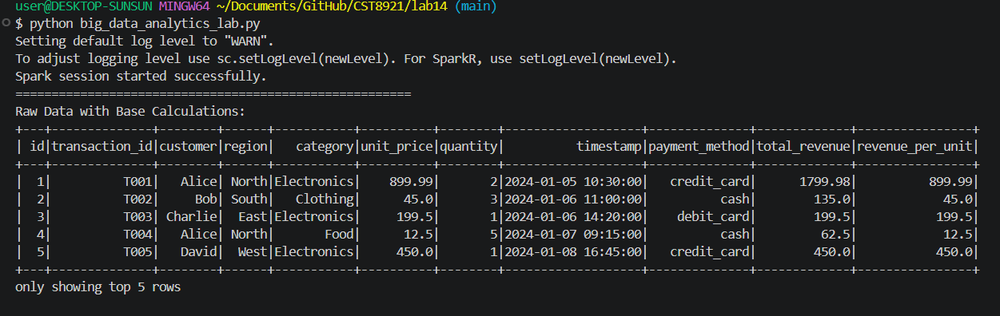
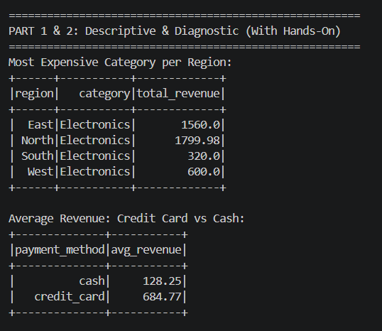
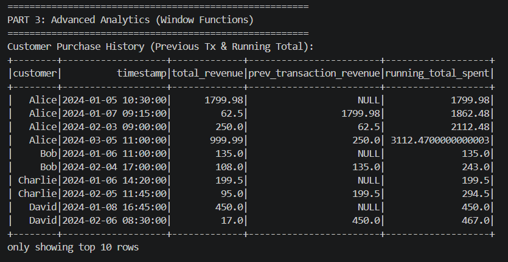
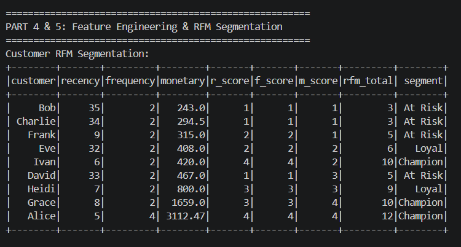
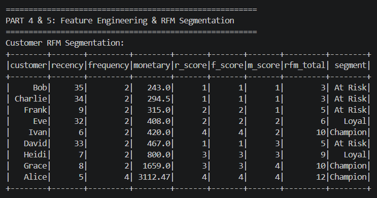
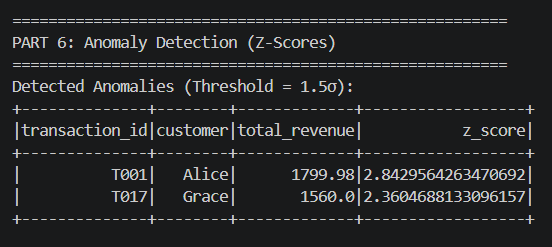
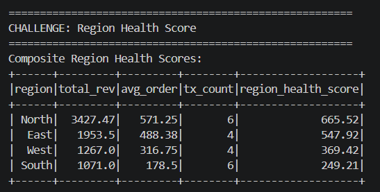

# Lab 14: Big Data Analytics

## Screenshots

These screenshots show proof of my work for Ex 1-6.

### Descriptive & Diagnostic Analytics (Ex 1 & 2)

### Advanced Analytics (Window Functions) (Ex 3)

### Customer Segmentation (RFM) (Ex 4)

### Anomaly Detection (Ex 5)

### Region Health Score Challenge (Ex 6)

## Discussion Questions

The hands-on exercises have these questions for Ex 4-6.

### 1. Does the high_quantity flag correlate with the payment method? (Ex 4)

Yes, it heavily correlates with cash payments.
Looking at the raw data for all transactions where quantity > 3, there are four transactions (T004, T006, T012, T019). Three out of those four high-quantity purchases were paid for using cash.

### 2. How do segment sizes change when you adjust the RFM scoring thresholds? (Ex 5)

The "Champion" segment completely disappears, and the "Loyal" segment absorbs those customers.

- Initial Run: I had 3 Champions (Ivan, Grace, Alice), 2 Loyal, and 4 At Risk.

- Changed Run: I raised the "Champion" threshold so high that even the best customer (Alice, with a max score of 12) didn't qualify.

- Result: Champions dropped from 3 to 0. Loyal grew from 2 to 5. At Risk stayed exactly the same at 4.

### 3. How many more anomalies are flagged when changing the threshold from 2σ to 1.5σ? (Ex 6)

Zero. 
The number of flagged anomalies remains exactly the same (2).
In both the 1.5σ and 2.0σ runs, the script flags the exact same two transactions: T001 (Alice) and T017 (Grace). This is because both of their z-scores (2.84 and 2.36) are exceptionally high, easily clearing both the 1.5 and 2.0 thresholds. There were no other transactions sitting in that "middle ground" between 1.5 and 2.0 to be caught by the lower threshold.