# Lab 5: Serverless Computing

Alice Yang 041200019 CST8921

## Part A: Environment Setup

### Step 1: Launch Visual Studio Code

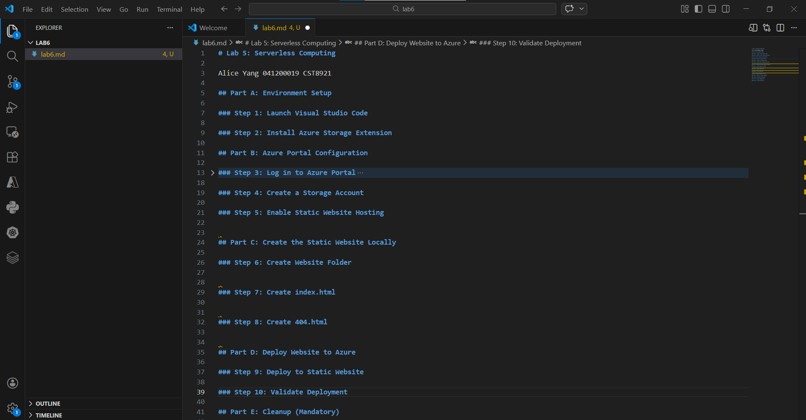

### Step 2: Install Azure Storage Extension

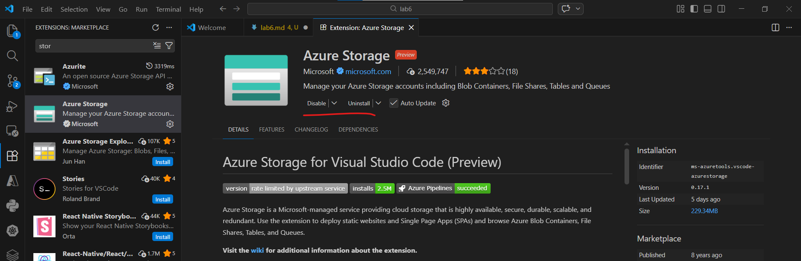

## Part B: Azure Portal Configuration

### Step 3: Log in to Azure Portal

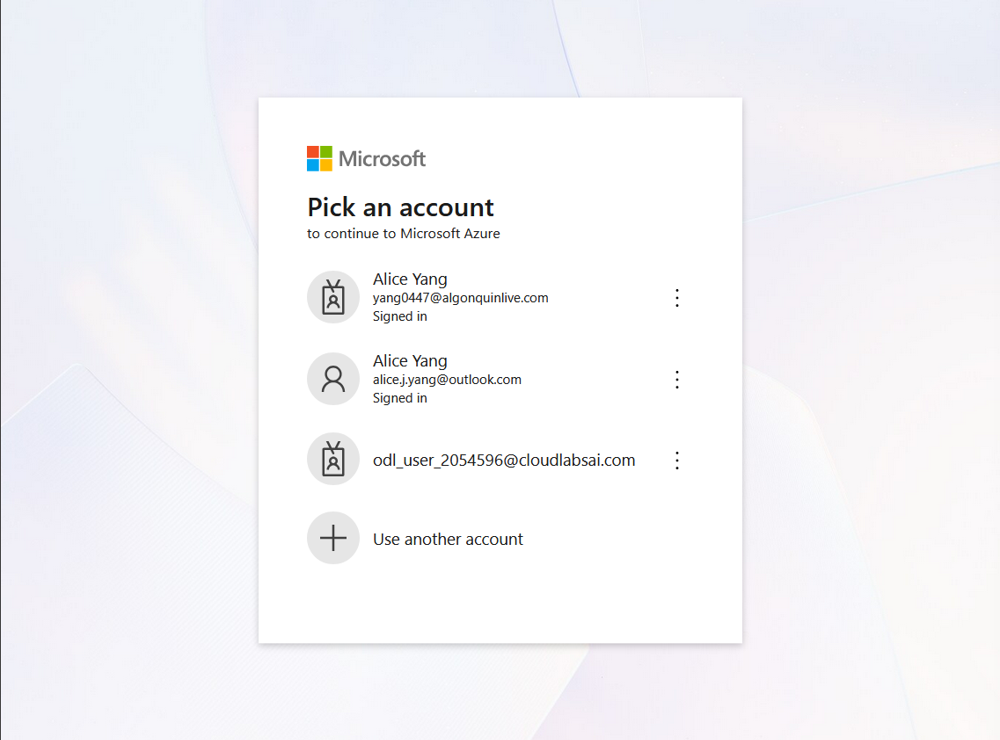
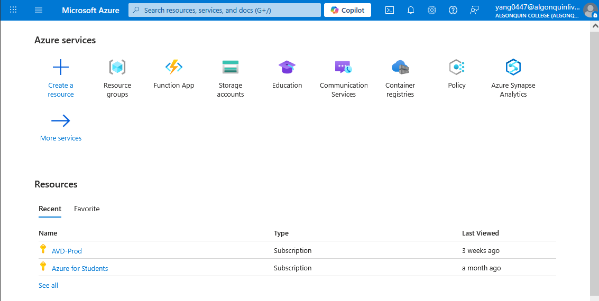

### Step 4: Create a Storage Account

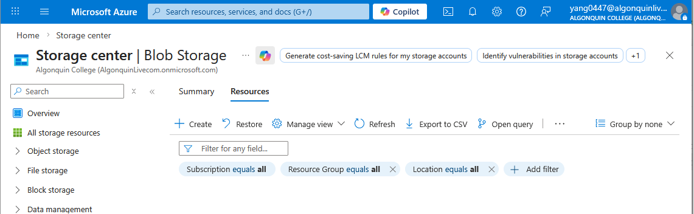
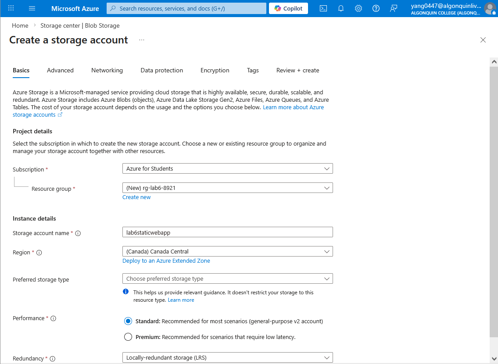
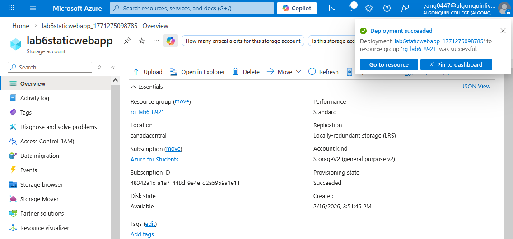

### Step 5: Enable Static Website Hosting

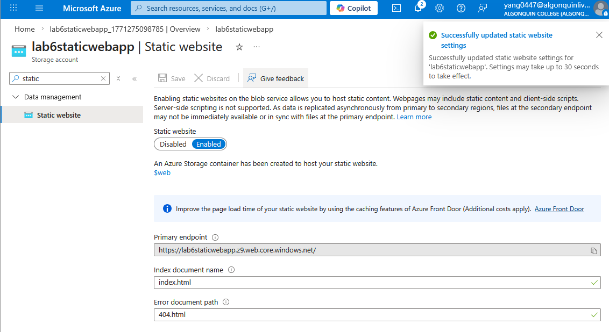

## Part C: Create the Static Website Locally

### Step 6: Create Website Folder

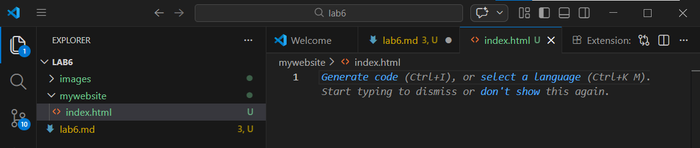

### Step 7: Create index.html

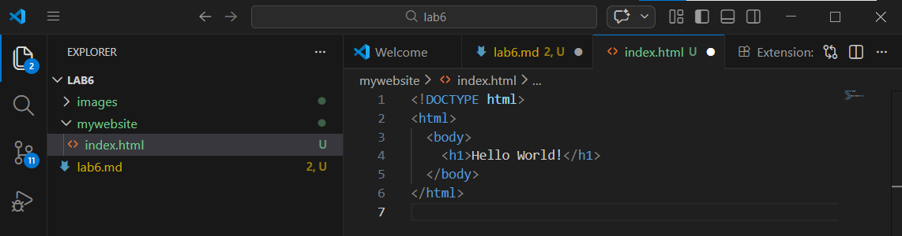

### Step 8: Create 404.html

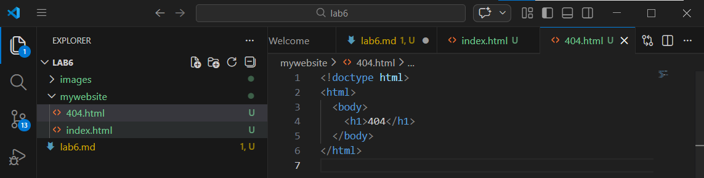

## Part D: Deploy Website to Azure

### Step 9: Deploy to Static Website

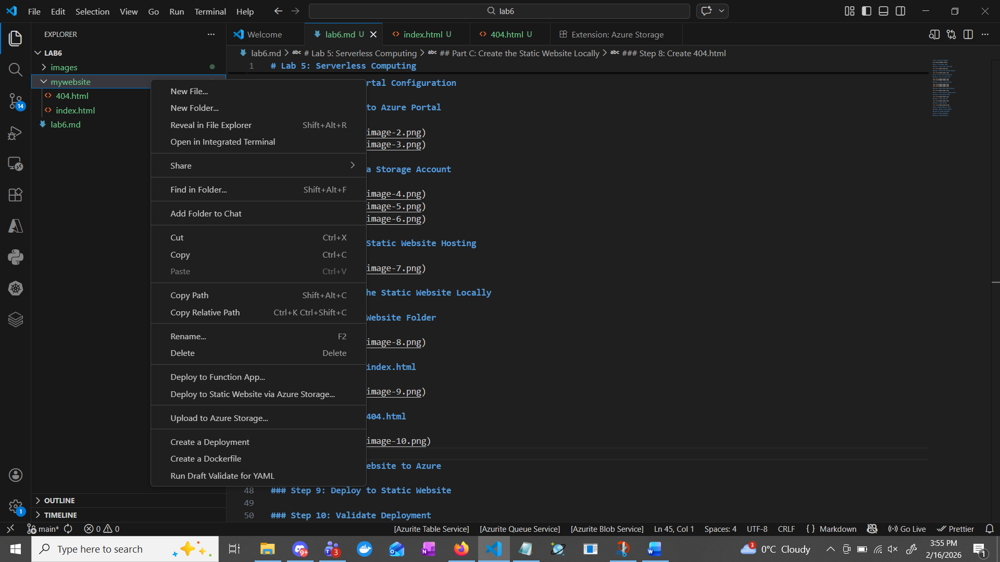
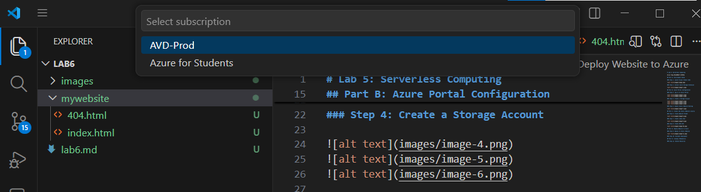
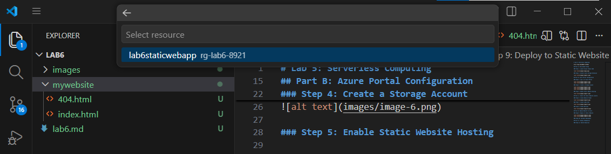
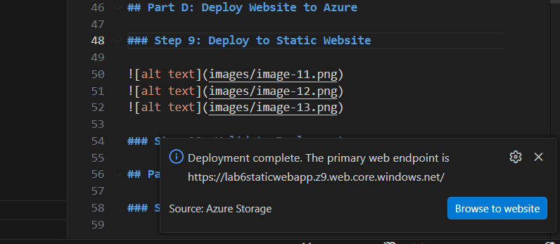

### Step 10: Validate Deployment

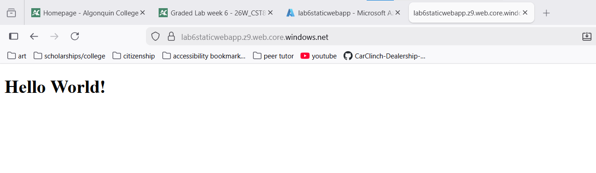
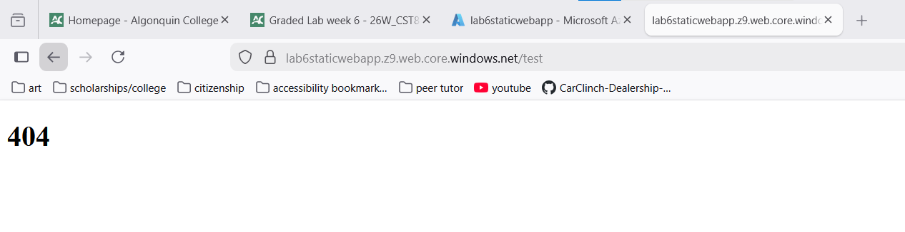

## Part E: Cleanup (Mandatory)

### Step 11: Delete Resources

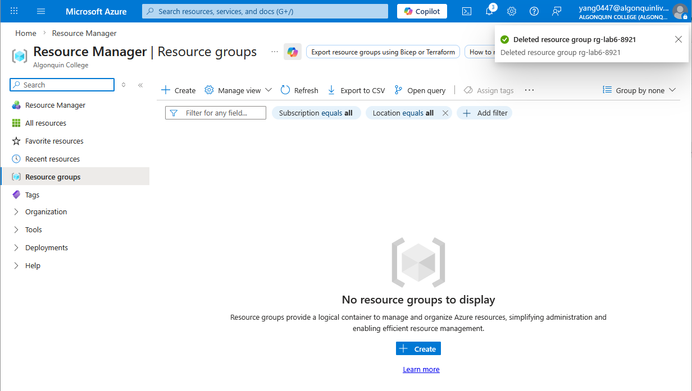